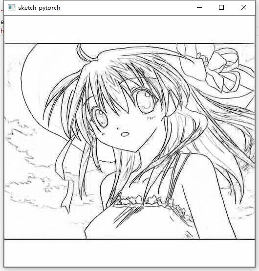

# Sketch Pytorch

A pretrained model which can convert an anime image to a sketch.

Thanks for the work of [lllyasviel](https://github.com/lllyasviel), here's [sketchKeras](https://github.com/lllyasviel/sketchKeras).

I just convert sketchKeras to a pytorch project.

And I also appreciate  [MMdnn](https://github.com/microsoft/MMdnn), this project helps me a lot.


## Requirement

- Pytorch

- Opencv

- Numpy

  

## Performance

We can assume there's no difference  between sketchKeras and sketch_pytorch.

I didn't make a strict test, maybe there's some very small differences, but I think it's not a big deal.





##  Usage

Put the folder ```./sketch_detector``` to your project, and use it as use a package.

```python
import cv2
import sketch_detector

img = cv2.imread("test_case.jpg")
result = sketch_detector.get_sketch(img)
cv2.imshow("sketch_pytorch",result)
cv2.waitKey()
```

As alternatives,  I also provide ```get_enhanced_sketch```, ```get_colored_sketch``` and ```get_pured_sketch```. Please see the differences on sketchKeras.

**Moreover, I hard-coded cuda mode. So, if you want to run this project on a cpu, you can delete ```.cuda()``` on line 11 and line 45 of ```sketch_detector.py```**


## How to convert a keras model to a pytorch model

Basically, you can follow steps on MMdnn, but I highly recommend you to convert a model step-by-step, don't use ```mmconvert``` directly.

1. Convert your model to IR files

   ```powershell
   mmtoir  -f keras -iw model.h5 -in model.json -o ir
   ```

   You can get your h5 file by ```model.save_weights(your_path)```, and get your json file by ```model.to_json()```. Then, you'll get ```ir.npy```, ```ir.pd```, ```ir.json```.

2. Convert IR files to Pytorch code snippet 

   ```powershell
   mmtocode -f pytorch -in ir.pb -iw ir.npy -o model.py -ow weight.pkl
   ```
   
3.  Edit ```model.py```

   Because of the compatibility, you may need modify some layers by your self. Please see the output of ```mmtocode```. 

   e.g.

   ```
   Parse file [ir.pb] with binary format successfully.
   Pytorch Emitter has not supported operator [UpSampling2D].
   up_sampling2d_1
   Pytorch Emitter has not supported operator [UpSampling2D].
   up_sampling2d_2
   Pytorch Emitter has not supported operator [UpSampling2D].
   up_sampling2d_3
   Pytorch Emitter has not supported operator [UpSampling2D].
   up_sampling2d_4
      Target network code snippet is saved as [pytorch_model.py].
      Target weights are saved as [pytorch_model_weight.pkl].
   ```
   Besides, please take your notice on the shapes of weights, you need to use ```torch.permute()```  or ```np.transpose()``` to change them.
   Finally, you can choose a fancy name to replace the default name("KitModel") of  this module.


4. Load your model  ```model = KitModel("ir.npy")```

### Important hint

You may need to set ```allow_pickle=True``` on ```model.py``` or you will meet a exception. 

According to stackoverflow comments, It only happens in the new version of numpy.